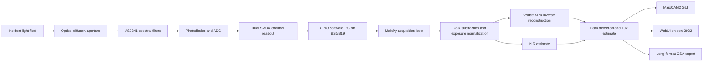
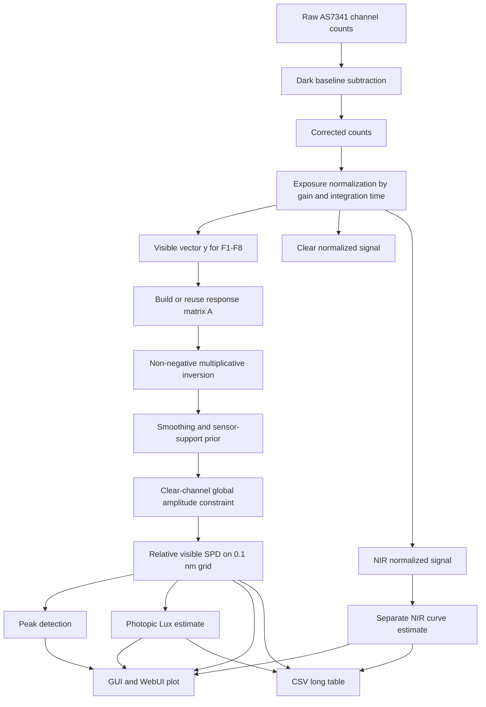

# AS7341 Spectrum for MaixCAM2

[中文说明](Readme_CN.md)

A MaixPy spectrometer application for Sipeed MaixCAM2 and the AMS/OSRAM AS7341 11-channel multispectral sensor. The project provides a complete measurement pipeline: GPIO software I2C, AS7341 dual-SMUX acquisition, touchscreen interaction, local GUI rendering, lightweight WebUI control, relative spectral power distribution reconstruction, peak detection, estimated illuminance, and long-format CSV export.

This README is written as a technical report so that users can understand not only how to run the application, but also the physical and numerical assumptions behind the spectrum reconstruction.

## Abstract

The AS7341 does not measure a continuous spectrum directly. It measures a small set of filtered broadband channels. Each visible channel integrates incoming optical power over a wavelength-dependent spectral response curve. Recovering a continuous spectrum from those channel values is therefore an inverse problem: many different spectra can produce similar channel readings.

This project reconstructs a useful relative visible SPD over 380-780 nm by combining an AS7341 response model, exposure normalization, non-negative multiplicative inversion, smoothing, Clear-channel global constraint, and sensor-support priors near poorly constrained spectral boundaries. The result is suitable for visualization, comparative spectral analysis, peak tracking, and educational work. It is not a replacement for a calibrated laboratory spectrometer unless the device is calibrated against reference optical equipment.

## Screenshots

### WebUI Platform


### MaixCAM2 GUI


## System Overview

The physical system is a compact spectral measurement platform:

- AS7341 sensor module mounted to MaixCAM2 over GPIO software I2C
- MaixCAM2 local display and touch input for standalone operation
- Optional HTTP WebUI for remote control and visualization
- CSV export for offline analysis and calibration



## Features

- Real-time MaixCAM2 touchscreen interface
- AS7341 dual-SMUX sampling for F1-F8, Clear, and NIR channels
- GPIO open-drain software I2C on B20/B19 for the current wiring
- Dark baseline zeroing, gain control, integration-time control, pause/run, CSV save, and exit controls
- 380-780 nm visible relative SPD reconstruction with a 0.1 nm internal grid and filled area plot
- Automatic visible-spectrum peak annotation, up to 5 peak wavelengths
- Separate 760-1000 nm IR estimate window, hidden by default and toggled by the top-right `IR` tab
- Lightweight WebUI on port `2932` for remote control, spectrum viewing, and CSV download

## Hardware

Target hardware:

- Sipeed MaixCAM2
- AS7341 spectral sensor module
- 3.3 V I/O wiring

Default wiring:

| AS7341 | MaixCAM2 |
| --- | --- |
| VDD | 3V3 |
| GND | GND |
| SCL | B20 |
| SDA | B19 |
| INT | B18 |
| GPIO | B21 |

B20/B19 are not assumed to be hardware I2C pins on the MaixCAM2 connector. This project uses GPIO open-drain software I2C by default, so the wiring above can be used directly. Do not drive MaixCAM2 GPIO pins with 5 V logic.

## Files

- `main.py`: Self-contained MaixPy application entry point, recommended for direct upload and execution.
- `app.yaml`: MaixPy application descriptor.
- `soft_i2c_gpio.py`: Modular software I2C implementation.
- `as7341_driver.py`: Modular AS7341 driver and spectrum reconstruction code.
- `spectrometer_ui.py`: Modular GUI drawing code.
- `as7341_spectrometer_maixcam2.py`: Modular application entry point.
- `AS7341_DS000504_3-00.pdf`: Local copy of the official AS7341 datasheet.
- `maixcam2_pins.jpg`: MaixCAM2 pin reference image.
- `Spectrum_Platform.png`: WebUI screenshot.
- `GUI.png`: MaixCAM2 GUI screenshot.

For MaixVision or the MaixPy runner, running `main.py` is recommended to avoid missing module upload errors.

## Usage

1. Wire the AS7341 to MaixCAM2 using the default wiring table.
2. Upload and run `main.py` on the MaixCAM2.
3. The app probes the AS7341 automatically at I2C address `0x39`.
4. Use the touchscreen buttons:
   - `Run/Pause`: Start or pause sampling
   - `Zero`: Capture the current dark baseline
   - `Gain -/+`: Adjust AS7341 analog gain
   - `Int -/+`: Adjust integration time
   - `Save`: Append the current sample to `as7341_spectrum_long.csv`
   - `Exit`: Exit the application
5. Tap the top-right `IR` tab to show or hide the IR estimate window.

## WebUI

The application starts a lightweight HTTP service on the MaixCAM2 when possible. The default port is `2932`.

Open this URL from a browser on the same network:

```text
http://<MaixCAM2-IP>:2932/
```

The WebUI supports:

- Live 380-780 nm visible SPD filled curve and peak labels
- Raw and corrected values for each AS7341 channel
- Remote `Run/Pause`, `Zero`, `Gain -/+`, `Int -/+`, `Save`, and `Exit`
- Direct `Download CSV` export of `as7341_spectrum_long.csv`

If the web service fails to start, the local touchscreen application still works.

## Signal Processing Chain

The implementation follows this processing chain for every valid sample:



## Physical Measurement Model

Let `Phi(lambda)` be the spectral radiant power distribution arriving at the sensor plane. It is the quantity the application tries to reconstruct up to a relative scale. Each AS7341 visible channel has a spectral response function `R_i(lambda)`, determined by its optical filter, photodiode behavior, and analog/electrical gain path.

For channel `i`, the ideal continuous measurement can be modeled as:

```text
m_i = g * t * integral(R_i(lambda) * Phi(lambda) d_lambda) + d_i + noise_i
```

Where:

- `m_i` is the raw ADC count for channel `i`
- `g` is sensor gain
- `t` is integration time
- `d_i` is the dark offset or dark baseline
- `noise_i` includes shot noise, read noise, quantization noise, I2C timing effects, and environment variation
- `R_i(lambda)` is the effective spectral response of the channel
- `Phi(lambda)` is the incident spectral power distribution at the sensor

After dark subtraction and exposure normalization:

```text
y_i = max(0, m_i - d_i) / (g * t)
    ~= integral(R_i(lambda) * Phi(lambda) d_lambda)
```

The application also applies a per-channel sensitivity normalization from typical AS7341 response data, producing a corrected channel vector:

```text
y'_i = y_i / s_i
```

Here `s_i` is a relative sensitivity scale. This is necessary because the same optical power does not produce the same ADC count in all AS7341 channels.

## Discrete Inverse Problem

The continuous spectrum is discretized onto a wavelength grid. In this project:

```text
lambda_j = 380.0 nm, 380.1 nm, ..., 780.0 nm
```

Let `x_j` be the unknown relative radiant power at `lambda_j`. The channel model becomes:

```text
y'_i ~= sum_j A_ij * x_j
```

In matrix form:

```text
y ~= A x
```

Where:

- `y` is the 8-element visible channel vector from F1-F8
- `A` is the response matrix built from channel center wavelength and FWHM
- `x` is the reconstructed visible SPD on the 0.1 nm grid

This system is underdetermined: there are only 8 visible measurements and 4001 wavelength grid points. Therefore, a unique high-resolution true spectrum cannot be recovered from the AS7341 alone. The 0.1 nm grid should be understood as a smooth interpolation and numerical representation of a low-dimensional inverse estimate, not as real 0.1 nm optical resolving power.

## Response Matrix Construction

The AS7341 datasheet provides nominal center wavelengths and bandwidths for visible channels. The implementation approximates each channel response as a Gaussian-like band:

```text
R_i(lambda) = exp(-0.5 * ((lambda - c_i) / sigma_i)^2)
sigma_i = FWHM_i / 2.355
```

Each row is normalized:

```text
A_ij = R_i(lambda_j) / sum_k R_i(lambda_k)
```

This produces a numerical response matrix whose rows represent how much each wavelength contributes to each channel. The model is approximate, because real sensor responses are not perfect Gaussians and vary with module optics, cover glass, diffuser, angle, temperature, and manufacturing tolerance.

For speed, the code stores sparse response rows. Very small Gaussian tails are truncated, and the response matrix is cached after first use.

## Non-negative Spectrum Reconstruction

The reconstruction requires non-negativity because optical radiant power cannot be negative:

```text
x_j >= 0
```

The implementation uses a multiplicative update similar in spirit to Richardson-Lucy style positive inverse methods:

```text
prediction_i = sum_j A_ij * x_j
ratio_i = y_i / max(prediction_i, epsilon)
x_j <- x_j * weighted_average_i(ratio_i)
```

In expanded form, the update is:

```text
x_j <- x_j * (sum_i A_ij * y_i / prediction_i) / (sum_i A_ij)
```

This update has useful properties for embedded use:

- It keeps `x_j` non-negative.
- It avoids matrix inversion.
- It is stable with a small number of sensor channels.
- It can be implemented with simple loops and cached response rows.

The application starts from an initial weighted estimate:

```text
x_j_initial = (sum_i A_ij * y_i) / (sum_i A_ij)
```

Then it performs a limited number of iterations. More iterations do not create true higher optical resolution; they mainly sharpen the numerical estimate and can amplify noise. The current code uses a conservative iteration count and smoothing to keep the displayed SPD stable.

## Regularization and Sensor-support Prior

Because the inverse problem is underdetermined, regularization is essential. The project uses three practical forms of regularization.

First, smoothing suppresses narrow numerical spikes that cannot be justified by AS7341 channel bandwidths:

```text
x <- blend * moving_average(x) + (1 - blend) * x
```

Second, a sensor-support prior reduces confidence where the sum of channel responses is weak:

```text
support_j = sum_i A_ij
prior_j = floor + (1 - floor) * normalized_support_j^0.65
x_j <- x_j * ((1 - alpha) + alpha * prior_j)
```

This is especially important at the low-wavelength boundary. F1 is centered near 415 nm, so the 380-405 nm region has weak independent support. Without a support prior, the inverse update can push energy toward the boundary and create false 380 nm peaks.

Third, peak detection ignores candidate peaks in regions with insufficient support. This prevents the GUI from labeling poorly constrained edge artifacts as physical spectral peaks.

## Clear-channel Constraint

The AS7341 Clear channel has a broad response. It is not a spectral channel, but it is useful as a global energy constraint. The implementation compares the reconstructed SPD's predicted Clear response with the measured Clear-normalized signal:

```text
clear_measured ~= corrected_Clear / (gain * integration_time)
clear_predicted = sum_j ClearResponse_j * x_j
scale = clear_measured / clear_predicted
```

The scale factor is clamped to a bounded range before being applied to the visible SPD. This prevents Clear from overwhelming the spectral shape while still making the reconstructed amplitude more consistent with the total broadband light level.

## NIR Handling

The NIR channel is intentionally not merged into the visible SPD. The visible reconstruction covers 380-780 nm, while the AS7341 NIR channel is centered around the near-infrared region. Merging NIR into the visible SPD would distort the visible plot and confuse peak interpretation.

Instead, the application reconstructs a separate NIR estimate over 760-1000 nm using an NIR-shaped response curve. The local GUI shows this in a separately toggleable IR window, and the CSV exports it with `kind=ir_spd`.

## Lux Estimate

Illuminance is a photometric quantity. It weights optical power by the human photopic luminous efficiency curve `V(lambda)`. In physical radiometry and photometry:

```text
illuminance_lux = 683 * integral(Phi(lambda) * V(lambda) d_lambda)
```

The code applies the same idea to the reconstructed relative SPD:

```text
lux_est ~= 683 * sum_j relative_power_j * V(lambda_j) * Delta_lambda * SPD_LUX_CALIBRATION
```

The default `SPD_LUX_CALIBRATION` is `0.02`, which scales the raw photopic integral down by about 50x based on observed behavior. This is still an estimate. For absolute Lux, the system must be calibrated with a reference lux meter:

```text
SPD_LUX_CALIBRATION_new = reference_lux / displayed_lux_est
```

The CSV also records:

```text
clear_lux_signal = corrected_Clear / (gain * integration_ms)
```

This allows users to compare SPD-derived Lux with a Clear-channel proxy and build their own calibration curve if their optical setup makes Clear more reliable.

## Why Wavelength-energy Correction Is Not Applied to the Main SPD

Photon energy is:

```text
E_photon = h * c / lambda
```

This relation is required when converting radiant power spectra into photon flux spectra, such as PPFD for plant lighting. However, the AS7341 response model used here is already based on channel response to optical power. Applying an additional `1/lambda` or `lambda` correction to the main radiant-power SPD would change the physical meaning of the plot and can overcorrect short wavelengths.

Therefore:

- The GUI and WebUI display relative radiant-power SPD.
- CSV `relative_power` stores the same radiant-power-like reconstruction.
- Photon flux should be derived later from exported data if needed:

```text
photon_flux_relative(lambda) proportional to relative_power(lambda) * lambda
```

## Peak Detection

Peak detection is performed on the normalized visible SPD. A candidate peak must:

- Be a local maximum
- Be above a minimum relative intensity threshold
- Be sufficiently separated from previously selected peaks
- Lie in a wavelength region with enough sensor support

The GUI and WebUI label up to 5 peaks. Because AS7341 channels are broad, peak positions should be interpreted as reconstructed peak estimates, not monochromator-grade line positions.

## Performance Considerations

The 0.1 nm grid contains 4001 visible points. Direct dense inversion would be unnecessarily expensive on embedded Python. The implementation reduces cost by:

- Caching the visible response matrix
- Truncating negligible Gaussian tails into sparse rows
- Caching Clear and NIR response curves
- Caching photopic `V(lambda)` weights
- Using multiplicative updates instead of matrix decompositions
- Downsampling WebUI plot data while preserving full-resolution CSV export

The CSV still exports every 0.1 nm point. The GUI and WebUI draw a downsampled representation to keep interaction responsive.

## Data Export

Pressing `Save` appends data to `as7341_spectrum_long.csv`. The export uses a long vertical table where each wavelength occupies one row. Fields include:

- Timestamp, gain, integration time, and saturation state
- Raw, dark, corrected, and normalized data for all 10 exported channels
- Visible SPD summary: dominant wavelength, centroid, estimated CCT, fit confidence, and peak list
- `kind,wavelength_nm,relative_intensity,relative_power`
- `lux_est,lux_source,clear_lux_signal`
- Full 0.1 nm visible SPD data over 380-780 nm
- Full 0.1 nm IR estimate data over 760-1000 nm

## Calibration Guidance

For rigorous use, perform at least two levels of calibration.

First, dark calibration:

- Cover the sensor or use a dark enclosure.
- Press `Zero`.
- Repeat if integration time or gain changes substantially.

Second, optical calibration:

- Use a stable reference light source or calibrated lux meter.
- Record the displayed `lux_est` and reference Lux.
- Adjust `SPD_LUX_CALIBRATION`.
- For spectral accuracy, use a monochromator or calibrated spectral source to derive a real device-specific response matrix.

A proper calibration matrix can be written conceptually as:

```text
y_calibrated = C_channel * y_measured
x_reconstructed = inverse_model(y_calibrated)
```

Where `C_channel` corrects channel gain, optical path response, diffuser transmission, and sensor-module variation.

## Limitations

- AS7341 has broad, overlapping channels; it cannot resolve narrow spectral lines like a grating spectrometer.
- The 0.1 nm grid is a reconstruction grid, not the physical optical resolution.
- Low-light measurements are affected by dark noise and quantization.
- Saturation invalidates the linear measurement model.
- Module optics, diffuser, angle of incidence, and temperature affect the response.
- Lux and CCT are estimates unless calibrated.
- NIR is exported separately and should not be interpreted as visible SPD.

## License

New source code in this project is released under the MIT License, copyright (c) 2026 Fona. See [LICENSE](LICENSE).

## Third-Party Notices

This project depends on or references the following third-party projects, hardware documents, and vendor materials. Their copyright and license notices remain in effect and are not relicensed by this project's MIT License.

- MaixPy and MaixCDK  
  Copyright (c) 2023- Sipeed Ltd.  
  Licensed under the Apache License, Version 2.0.  
  Project: <https://github.com/sipeed/MaixPy>

- Adafruit CircuitPython AS7341 driver  
  Copyright (c) 2020 Bryan Siepert for Adafruit Industries.  
  Licensed under the MIT License.  
  Project: <https://github.com/adafruit/Adafruit_CircuitPython_AS7341>

- AS7341 datasheet and sensor documentation  
  AS7341 is a product and trademarked device documentation of AMS/OSRAM or its respective rights holders. The included datasheet is retained as vendor reference documentation and remains under its original copyright.

- MaixCAM2 hardware, pinout image, board names, and product documentation  
  MaixCAM2 and related board documentation belong to Sipeed Ltd. or their respective rights holders. Hardware names and diagrams are used only for compatibility and wiring reference.

## Disclaimer

This software is provided for research, education, and prototyping. It is not certified for safety-critical, medical, industrial metrology, or regulatory measurement use. Validate hardware, calibration, optical path, and exported spectral data before relying on results.
