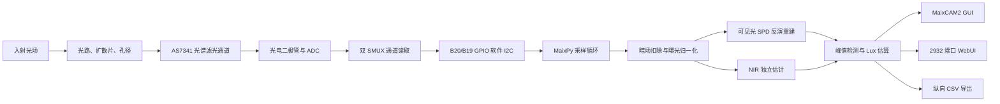
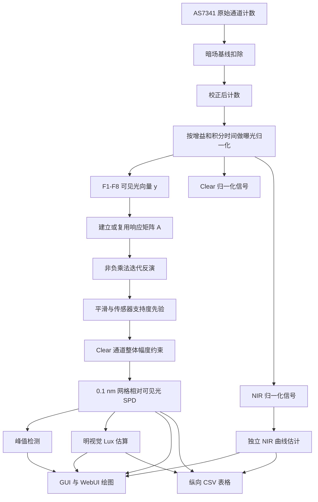

# AS7341 Spectrum for MaixCAM2

[English README](README.md)

基于 Sipeed MaixCAM2 和 AMS/OSRAM AS7341 11 通道多光谱传感器的触摸屏光谱仪应用。项目使用 MaixPy 编写，包含软件 I2C、AS7341 采样驱动、触摸交互 UI、相对光谱重建、峰值标注、轻量 WebUI 和 CSV 数据导出。

本文档按照技术报告的方式组织，不只说明如何运行程序，也解释光谱重建背后的物理模型、数学反演过程、正则化策略和标定方法。

## 摘要

AS7341 并不是直接测量连续光谱的高分辨率光谱仪。它通过一组滤光通道测量宽带积分结果。每一个可见光通道测到的是入射光谱功率分布与该通道光谱响应函数的积分。因此，从 AS7341 的少量通道值恢复连续光谱，本质上是一个欠定反问题：多个不同光谱都可能产生相近的通道读数。

本项目通过 AS7341 响应模型、曝光归一化、非负乘法迭代反演、平滑约束、Clear 通道整体约束和边界支持度先验，在 380-780 nm 范围内重建相对可见光 SPD。该结果适合可视化、相对比较、峰值跟踪和教学研究。若没有使用标准光源、单色仪或标准照度计进行设备级标定，不应把结果视为实验室级绝对辐照度或绝对光谱。

## 截图

### WebUI 平台界面


### MaixCAM2 GUI


## 系统概览

该系统是一个紧凑型光谱测量平台：

- AS7341 传感器模块通过 GPIO 软件 I2C 接入 MaixCAM2
- MaixCAM2 本地屏幕和触摸输入用于独立操作
- 可选 HTTP WebUI 用于远程控制和观察
- CSV 导出用于离线分析和后续标定



## 功能

- MaixCAM2 触摸屏实时交互界面
- AS7341 双 SMUX 周期读取 F1-F8、Clear、NIR 通道
- B20/B19 GPIO 开漏软件 I2C，适配当前接线
- 暗场归零、增益调节、积分时间调节、暂停/运行、CSV 保存和退出
- 380-780 nm 可见光相对 SPD 重建，0.1 nm 内部网格，填充面积图显示
- 可见光峰值自动标注，最多显示 5 个峰值波长
- 760-1000 nm 红外估计小窗，默认隐藏，点击右上角 `IR` 标签显示/隐藏
- 轻量 WebUI，默认监听 `2932` 端口，可远程查看光谱曲线、操作按钮并下载 CSV

## 硬件

目标硬件：

- Sipeed MaixCAM2
- AS7341 光谱传感器模块
- 3.3 V I/O 接线

当前默认接线：

| AS7341 | MaixCAM2 |
| --- | --- |
| VDD | 3V3 |
| GND | GND |
| SCL | B20 |
| SDA | B19 |
| INT | B18 |
| GPIO | B21 |

注意：MaixCAM2 引脚图中 B20/B19 默认不是硬件 I2C 引脚。本项目默认使用 GPIO 开漏软件 I2C，因此无需修改上述接线。请勿向 MaixCAM2 GPIO 输入 5 V 电平。

## 文件

- `main.py`: 单文件 MaixPy 应用入口，推荐直接上传运行。
- `app.yaml`: MaixPy 应用描述文件。
- `soft_i2c_gpio.py`: 软件 I2C 模块化版本。
- `as7341_driver.py`: AS7341 驱动与光谱重建模块化版本。
- `spectrometer_ui.py`: UI 绘制模块化版本。
- `as7341_spectrometer_maixcam2.py`: 模块化应用入口。
- `AS7341_DS000504_3-00.pdf`: AS7341 官方数据手册副本。
- `maixcam2_pins.jpg`: MaixCAM2 引脚参考图。
- `Spectrum_Platform.png`: WebUI 截图。
- `GUI.png`: MaixCAM2 GUI 截图。

实际在 MaixVision 或 MaixPy 运行器中，推荐直接运行 `main.py`，避免多文件上传遗漏导致导入错误。

## 使用

1. 按默认接线连接 AS7341 和 MaixCAM2。
2. 将 `main.py` 上传到 MaixCAM2 并运行。
3. 启动后应用会自动探测 AS7341，地址为 `0x39`。
4. 在触摸屏上使用底部按钮：
   - `Run/Pause`: 运行或暂停采样
   - `Zero`: 采集当前暗场作为基线
   - `Gain -/+`: 调整 AS7341 模拟增益
   - `Int -/+`: 调整积分时间
   - `Save`: 将当前样本追加保存到 `as7341_spectrum_long.csv`
   - `Exit`: 退出应用
5. 点击右上角 `IR` 标签显示或隐藏红外估计小窗。

## WebUI

应用启动后会尝试在 MaixCAM2 上启动轻量 HTTP 服务，默认端口为 `2932`。

在与 MaixCAM2 同一网络下，使用浏览器访问：

```text
http://<MaixCAM2-IP>:2932/
```

网页端支持：

- 查看实时 380-780 nm 可见光 SPD 填充曲线和峰值标注
- 查看各 AS7341 通道 raw/corrected 数值
- 远程执行 `Run/Pause`、`Zero`、`Gain -/+`、`Int -/+`、`Save`、`Exit`
- 通过 `Download CSV` 直接下载 `as7341_spectrum_long.csv`

如果 Web 服务启动失败，本机触摸屏应用仍可正常运行。

## 信号处理链路

每一次有效采样都会经过以下链路：



## 物理测量模型

设 $\Phi(\lambda)$ 为到达传感器平面的光谱辐射功率分布，也就是程序希望重建的相对光谱量。AS7341 的每个可见光通道都有一个光谱响应函数 $R_i(\lambda)$，它由滤光片、光电二极管、模拟链路和 ADC 响应共同决定。

对第 $i$ 个通道，理想连续模型可写为：

$$
m_i = g\,t \int R_i(\lambda)\,\Phi(\lambda)\,d\lambda + d_i + n_i
$$

其中：

- $m_i$ 是通道 $i$ 的原始 ADC 计数
- $g$ 是传感器增益
- $t$ 是积分时间
- $d_i$ 是暗电流、偏置或暗场基线
- $n_i$ 包含散粒噪声、读出噪声、量化噪声、I2C 时序和环境波动
- $R_i(\lambda)$ 是通道有效光谱响应
- $\Phi(\lambda)$ 是入射光谱功率分布

暗场扣除和曝光归一化后：

$$
\begin{aligned}
y_i &= \frac{\max(0,\,m_i-d_i)}{g\,t} \\
&\approx \int R_i(\lambda)\,\Phi(\lambda)\,d\lambda
\end{aligned}
$$

程序还根据 AS7341 的典型响应数据对不同通道做相对灵敏度归一化：

$$
y'_i = \frac{y_i}{s_i}
$$

这里 $s_i$ 是相对灵敏度因子。它的意义是：相同光功率照射到不同 AS7341 通道时，不会产生相同 ADC 计数，因此必须先消除通道灵敏度差异。

## 离散反问题

连续光谱被离散化到波长网格。本项目使用：

$$
\lambda_j \in \{380.0,\,380.1,\,...,\,780.0\}\ \mathrm{nm}
$$

设 $x_j$ 是 $\lambda_j$ 上的未知相对辐射功率。通道模型离散后为：

$$
y'_i \approx \sum_j A_{ij}x_j
$$

矩阵形式为：

$$
\mathbf{y} \approx A\mathbf{x}
$$

其中：

- $\mathbf{y}$ 是 F1-F8 构成的 8 维可见光通道向量
- $A$ 是由中心波长和 FWHM 构建的响应矩阵
- $\mathbf{x}$ 是 0.1 nm 网格上的待重建可见光 SPD

这是一个严重欠定问题：可见光只有 8 个观测量，而 0.1 nm 网格有 4001 个波长点。因此，AS7341 无法唯一恢复真实高分辨率光谱。0.1 nm 表示数值重建和光滑插值网格，不代表传感器具有 0.1 nm 的真实光学分辨率。

## 响应矩阵构建

AS7341 数据手册给出了可见光通道的标称中心波长和带宽。程序使用近似高斯带通函数描述每个通道：

$$
\begin{aligned}
R_i(\lambda) &= \exp\left[-\frac{1}{2}\left(\frac{\lambda-c_i}{\sigma_i}\right)^2\right] \\
\sigma_i &= \frac{\mathrm{FWHM}_i}{2.355}
\end{aligned}
$$

每一行响应都会归一化：

$$
A_{ij} = \frac{R_i(\lambda_j)}{\sum_k R_i(\lambda_k)}
$$

这样构建出的响应矩阵表示每个波长点对每个通道的贡献比例。该模型是近似模型，因为真实传感器响应并非完美高斯函数，而且会受到模块光路、盖板、扩散片、入射角、温度和制造偏差影响。

为了提高速度，代码会截断很小的高斯尾部，将响应矩阵存为稀疏行，并在首次计算后缓存。

## 非负光谱重建

光学辐射功率不能为负，因此反演必须满足：

$$
x_j \ge 0
$$

程序使用一种与 Richardson-Lucy 正反卷积思想相近的非负乘法更新：

$$
\begin{aligned}
\hat{y}_i &= \sum_j A_{ij}x_j \\
r_i &= \frac{y_i}{\max(\hat{y}_i,\,\epsilon)} \\
x_j &\leftarrow x_j \cdot \operatorname{weighted\_average}_i(r_i)
\end{aligned}
$$

展开后：

$$
x_j \leftarrow x_j \cdot
\frac{\sum_i A_{ij}\,\frac{y_i}{\hat{y}_i}}
{\sum_i A_{ij}}
$$

这种更新适合嵌入式 Python：

- 能保持 $x_j$ 非负
- 不需要显式矩阵求逆
- 对少通道传感器比较稳定
- 可以用简单循环和缓存响应行实现

初始值使用加权反投影：

$$
x_{j,\mathrm{initial}} =
\frac{\sum_i A_{ij}y_i}{\sum_i A_{ij}}
$$

随后进行有限轮迭代。更多迭代并不会创造真实高光谱分辨率，反而可能放大噪声和欠定问题。因此当前程序使用保守迭代次数并结合平滑，保证显示的 SPD 更稳定。

## 正则化与传感器支持度先验

由于反问题欠定，正则化是必要的。本项目主要使用三种正则化。

第一，平滑抑制窄尖峰。AS7341 可见光通道的 FWHM 是几十 nm，过窄尖峰通常不是传感器真正能分辨的物理结构：

$$
\mathbf{x} \leftarrow
\beta\,\operatorname{moving\_average}(\mathbf{x}) + (1-\beta)\mathbf{x}
$$

第二，传感器支持度先验降低弱约束区域的能量：

$$
\begin{aligned}
\operatorname{support}_j &= \sum_i A_{ij} \\
\operatorname{prior}_j &= f + (1-f)\,\operatorname{support}_{j,\mathrm{norm}}^{0.65} \\
x_j &\leftarrow x_j\left[(1-\alpha)+\alpha\,\operatorname{prior}_j\right]
\end{aligned}
$$

这对短波边界尤其重要。F1 中心约在 415 nm，380-405 nm 区域缺少独立强约束。如果不加先验，非负迭代可能把能量推到 380 nm 边界并产生假峰。

第三，峰值检测会忽略传感器支持度不足的候选点，避免 GUI 把边界伪峰标成真实峰值。

## Clear 通道约束

AS7341 Clear 通道响应很宽。它不是窄带光谱通道，但可以作为整体能量约束。程序比较重建 SPD 对 Clear 响应的预测值和实际测得的 Clear 归一化信号：

$$
\begin{aligned}
C_{\mathrm{measured}} &\approx
\frac{\mathrm{corrected\_Clear}}{g\,t} \\
C_{\mathrm{predicted}} &= \sum_j C_j x_j \\
\mathrm{scale} &= \frac{C_{\mathrm{measured}}}{C_{\mathrm{predicted}}}
\end{aligned}
$$

这个比例会被限制在一个合理范围内，再用于调整可见光 SPD 幅度。这样可以利用 Clear 的总光强信息，同时避免 Clear 通道过度改变 F1-F8 决定的光谱形状。

## NIR 处理

NIR 通道不会合并进主可见光 SPD。主 SPD 覆盖 380-780 nm，而 AS7341 的 NIR 通道位于近红外区域。若把 NIR 强行并入主图，会扭曲可见光曲线，也会让峰值解释混乱。

程序会在 760-1000 nm 范围内用 NIR 响应曲线单独生成红外估计。GUI 中它位于可切换的 IR 小窗中，CSV 中以 `kind=ir_spd` 单独导出。

## Lux 估算

照度是光度学量，它不是简单光功率，而是按人眼明视觉效率函数 $V(\lambda)$ 加权后的光通量密度。物理上：

$$
E_v = 683 \int \Phi(\lambda)V(\lambda)\,d\lambda
$$

程序将同样思想用于重建的相对 SPD：

$$
\mathrm{lux}_{\mathrm{est}} \approx
683 \sum_j p_j V(\lambda_j)\Delta\lambda \cdot K_{\mathrm{SPD}}
$$

默认 `SPD_LUX_CALIBRATION` 为 `0.02`，相当于把原始明视觉积分缩小约 50 倍。这仍然是估算值。若需要绝对 Lux，必须使用标准照度计重新标定：

$$
K_{\mathrm{SPD,new}} =
\frac{\mathrm{reference\_lux}}{\mathrm{displayed\_lux}_{\mathrm{est}}}
$$

CSV 同时记录：

$$
\mathrm{clear\_lux\_signal} =
\frac{\mathrm{corrected\_Clear}}{g\,t_{\mathrm{ms}}}
$$

这样用户可以比较 SPD 明视觉积分和 Clear 通道代理量，也可以在自己的光路条件下建立更适合的照度标定曲线。

## 为什么主 SPD 不再额外做波长能量修正

单个光子的能量为：

$$
E_{\mathrm{photon}} = \frac{hc}{\lambda}
$$

这个关系在将辐射功率谱转换为光子通量谱时非常重要，例如植物照明中的 PPFD。但本项目当前的主 SPD 是相对辐射功率谱，AS7341 的响应模型也已经是在光功率响应意义上建立的。如果再对主图额外套用 $1/\lambda$ 或 $\lambda$ 修正，会改变曲线物理含义，并可能再次抬高或压低短波端。

因此：

- GUI 和 WebUI 显示的是相对辐射功率 SPD
- CSV 的 `relative_power` 保存同一类相对功率谱
- 如需光子通量，可在导出数据上另行转换：

$$
\Phi_{\mathrm{photon,rel}}(\lambda) \propto p_{\mathrm{rel}}(\lambda)\lambda
$$

## 峰值检测

峰值检测在归一化可见光 SPD 上执行。候选峰需要满足：

- 是局部极大值
- 高于最小相对强度阈值
- 与已经选择的峰保持足够波长间距
- 位于传感器支持度足够的区域

GUI 和 WebUI 最多标注 5 个峰。由于 AS7341 通道较宽，峰位应理解为重建估计峰位，而不是单色仪级谱线位置。

## 性能设计

0.1 nm 网格包含 4001 个可见光点。若直接做稠密矩阵反演，会给嵌入式 Python 带来不必要负担。程序通过以下方式提高响应速度：

- 缓存可见光响应矩阵
- 截断很小的高斯尾部，使用稀疏响应行
- 缓存 Clear 响应和 NIR 曲线形状
- 缓存明视觉 $V(\lambda)$ 权重
- 使用乘法更新而不是矩阵分解
- WebUI 绘图数据降采样，CSV 仍保留完整 0.1 nm 数据

CSV 会导出每一个 0.1 nm 点。GUI 和 WebUI 则绘制降采样后的视觉表示，以保持交互流畅。

## 数据导出

点击 `Save` 后，数据追加到 `as7341_spectrum_long.csv`。导出为纵向长表，每个波长占一行。字段包括：

- 采样时间戳、增益、积分时间、饱和状态
- 10 个通道的 raw、dark、corrected、normalized 数据
- 可见光 SPD 摘要：主峰、质心、估算 CCT、拟合置信度、峰值列表
- `kind,wavelength_nm,relative_intensity,relative_power`
- `lux_est,lux_source,clear_lux_signal`
- 380-780 nm 可见光 SPD 完整 0.1 nm 连续数据
- 760-1000 nm 红外估计完整 0.1 nm 连续数据

## 标定建议

严肃使用时至少建议做两级标定。

第一，暗场标定：

- 遮住传感器或放入暗箱。
- 点击 `Zero`。
- 若积分时间或增益变化较大，应重新暗场标定。

第二，光学校准：

- 使用稳定参考光源或标准照度计。
- 记录显示的 `lux_est` 与参考 Lux。
- 调整 `SPD_LUX_CALIBRATION`。
- 若要提高光谱准确性，使用单色仪或标准光谱源建立设备级响应矩阵。

设备级标定矩阵可概念化写为：

$$
\begin{aligned}
\mathbf{y}_{\mathrm{calibrated}} &= C_{\mathrm{channel}}\mathbf{y}_{\mathrm{measured}} \\
\mathbf{x}_{\mathrm{reconstructed}} &= \operatorname{inverse\_model}(\mathbf{y}_{\mathrm{calibrated}})
\end{aligned}
$$

其中 $C_{\mathrm{channel}}$ 用于补偿通道增益、光路响应、扩散片透过率和传感器模块差异。

## 局限性

- AS7341 通道较宽且相互重叠，不能像光栅光谱仪一样分辨窄谱线。
- 0.1 nm 是重建网格，不是物理光学分辨率。
- 弱光下测量会受到暗噪声和量化噪声影响。
- 饱和会破坏线性测量模型。
- 模块光路、扩散片、入射角和温度都会影响响应。
- Lux 和 CCT 未标定时都是估算值。
- NIR 单独导出，不应解释为可见光 SPD 的一部分。

## 许可证

本项目新增源代码以 MIT License 发布，版权署名为 Copyright (c) 2026 Fona。详见 [LICENSE](LICENSE)。

## 第三方声明

本项目依赖或参考以下第三方项目、硬件资料和文档。其版权和许可声明应被保留，并不因本项目使用 MIT License 而被重新授权。

- MaixPy and MaixCDK  
  Copyright (c) 2023- Sipeed Ltd.  
  Licensed under the Apache License, Version 2.0.  
  Project: <https://github.com/sipeed/MaixPy>

- Adafruit CircuitPython AS7341 driver  
  Copyright (c) 2020 Bryan Siepert for Adafruit Industries.  
  Licensed under the MIT License.  
  Project: <https://github.com/adafruit/Adafruit_CircuitPython_AS7341>

- AS7341 datasheet and sensor documentation  
  AS7341 is a product and trademarked device documentation of AMS/OSRAM or its respective rights holders. The included datasheet is retained as vendor reference documentation and remains under its original copyright.

- MaixCAM2 hardware, pinout image, board names, and product documentation  
  MaixCAM2 and related board documentation belong to Sipeed Ltd. or their respective rights holders. Hardware names and diagrams are used only for compatibility and wiring reference.

## 免责声明

This software is provided for research, education, and prototyping. It is not certified for safety-critical, medical, industrial metrology, or regulatory measurement use. Validate hardware, calibration, optical path, and exported spectral data before relying on results.
