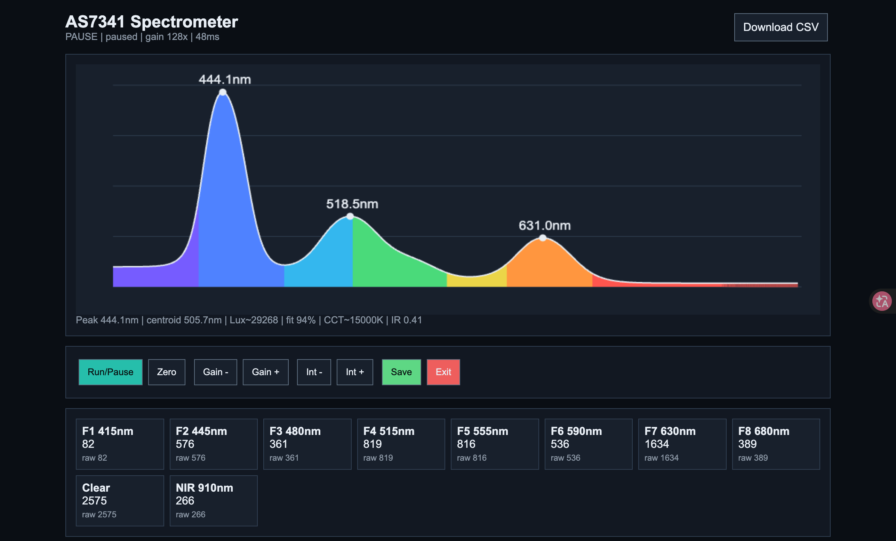
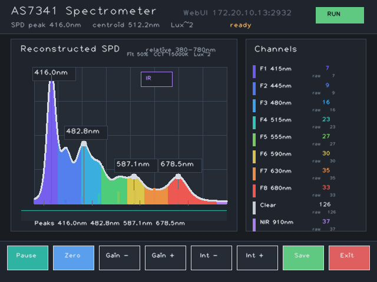

# AS7341 Spectrum for MaixCAM2

[English README](README.md)

基于 Sipeed MaixCAM2 和 AMS/OSRAM AS7341 11 通道多光谱传感器的触摸屏光谱仪应用。项目使用 MaixPy 编写，包含软件 I2C、AS7341 采样驱动、触摸交互 UI、相对光谱重建、峰值标注、轻量 WebUI 和 CSV 数据导出。

## 截图

### WebUI 平台界面



### MaixCAM2 GUI



## 功能

- MaixCAM2 触摸屏实时交互界面
- AS7341 双 SMUX 周期读取 F1-F8、Clear、NIR 通道
- B20/B19 GPIO 开漏软件 I2C，适配当前接线
- 暗场归零、增益调节、积分时间调节、暂停/运行、CSV 保存和退出
- 380-780 nm 可见光相对 SPD 重建，0.1 nm 内部网格，填充面积图显示
- 可见光峰值自动标注，最多显示 5 个峰值波长
- 760-1000 nm 红外估计小窗，默认隐藏，点击右上角 `IR` 标签显示/隐藏
- 轻量 WebUI，默认监听 `2932` 端口，可远程查看光谱曲线、操作按钮并下载 CSV

## 硬件

目标硬件：

- Sipeed MaixCAM2
- AS7341 光谱传感器模块
- 3.3 V I/O 接线

当前默认接线：

| AS7341 | MaixCAM2 |
| --- | --- |
| VDD | 3V3 |
| GND | GND |
| SCL | B20 |
| SDA | B19 |
| INT | B18 |
| GPIO | B21 |

注意：MaixCAM2 引脚图中 B20/B19 默认不是硬件 I2C 引脚。本项目默认使用 GPIO 开漏软件 I2C，因此无需修改上述接线。请勿向 MaixCAM2 GPIO 输入 5 V 电平。

## 文件

- `main.py`: 单文件 MaixPy 应用入口，推荐直接上传运行。
- `app.yaml`: MaixPy 应用描述文件。
- `soft_i2c_gpio.py`: 软件 I2C 模块化版本。
- `as7341_driver.py`: AS7341 驱动与光谱重建模块化版本。
- `spectrometer_ui.py`: UI 绘制模块化版本。
- `as7341_spectrometer_maixcam2.py`: 模块化应用入口。
- `AS7341_DS000504_3-00.pdf`: AS7341 官方数据手册副本。
- `maixcam2_pins.jpg`: MaixCAM2 引脚参考图。
- `Spectrum_Platform.png`: WebUI 截图。
- `GUI.png`: MaixCAM2 GUI 截图。

实际在 MaixVision 或 MaixPy 运行器中，推荐直接运行 `main.py`，避免多文件上传遗漏导致导入错误。

## 使用

1. 按默认接线连接 AS7341 和 MaixCAM2。
2. 将 `main.py` 上传到 MaixCAM2 并运行。
3. 启动后应用会自动探测 AS7341，地址为 `0x39`。
4. 在触摸屏上使用底部按钮：
   - `Run/Pause`: 运行或暂停采样
   - `Zero`: 采集当前暗场作为基线
   - `Gain -/+`: 调整 AS7341 模拟增益
   - `Int -/+`: 调整积分时间
   - `Save`: 将当前样本追加保存到 `as7341_spectrum_long.csv`
   - `Exit`: 退出应用
5. 点击右上角 `IR` 标签显示或隐藏红外估计小窗。

## WebUI

应用启动后会尝试在 MaixCAM2 上启动轻量 HTTP 服务，默认端口为 `2932`。

在与 MaixCAM2 同一网络下，使用浏览器访问：

```text
http://<MaixCAM2-IP>:2932/
```

网页端支持：

- 查看实时 380-780 nm 可见光 SPD 填充曲线和峰值标注
- 查看各 AS7341 通道 raw/corrected 数值
- 远程执行 `Run/Pause`、`Zero`、`Gain -/+`、`Int -/+`、`Save`、`Exit`
- 通过 `Download CSV` 直接下载 `as7341_spectrum_long.csv`

如果 Web 服务启动失败，本机触摸屏应用仍可正常运行。

## 光谱重建

AS7341 是 11 通道多光谱传感器，不是高分辨率光谱仪。项目中的 SPD 是相对光谱重建结果，不是未经标定即可作为绝对辐照度的实验室级光谱数据。

当前算法流程：

- 对原始通道值进行暗场扣除。
- 按增益和积分时间做曝光归一化。
- 使用 AS7341 数据手册中的中心波长、FWHM 和典型响应构建通道响应模型。
- 对 F1-F8 可见光通道进行非负平滑反演，生成 380-780 nm、0.1 nm 网格的相对 SPD。
- Clear 通道用于整体 SPD 约束，并记录 Clear 归一化信号用于后续标定。
- NIR 通道不与主 SPD 合并，单独生成 760-1000 nm 红外估计小谱。
- 对可见光 SPD 执行局部峰检测，最多标注 5 个峰值波长。
- 响应矩阵、Clear 响应和 NIR 曲线会缓存；WebUI 绘图数据会降采样，但 CSV 保留完整 0.1 nm 连续数据。
- 低波长端使用传感器支持度先验和峰值支持度门限，减少 380-405 nm 这类缺少独立通道约束区域的边界假峰。

主 SPD 按相对辐射功率谱处理。AS7341 数据手册给出的通道响应已经体现了器件对不同波长光功率的响应差异，因此主图不再额外套用 `E = hc/lambda` 做波长能量修正，避免重复抬高短波端。如果需要光子数谱或 PPFD，应在导出的相对功率谱基础上单独按波长转换。

Lux 读数来自重建可见光 SPD 的明视觉积分估算：

```text
lux_est ~= 683 * integral(relative_power(lambda) * V(lambda) d_lambda) * SPD_LUX_CALIBRATION
```

`V(lambda)` 是近似明视觉响应曲线。这是较早版本使用的 Lux 方法，通常会比直接 Clear 通道线性映射给出更大的、观感上更接近的读数。CSV 仍会记录 `clear_lux_signal = corrected_Clear / (gain * integration_ms)`，用于后续标定和对比。

默认 `SPD_LUX_CALIBRATION` 是便于观察的估算系数，不是出厂标定值。若要得到可信绝对照度，请使用标准照度计测量同一光源，按以下方式重新标定：

```text
SPD_LUX_CALIBRATION = reference_lux / displayed_lux_est
```

若需要更接近真实光谱，需要使用标准光源或单色仪建立设备级校准矩阵，并根据传感器模块、扩散片、光路和温度重新标定。

## 数据导出

点击 `Save` 后，数据追加到 `as7341_spectrum_long.csv`。导出为纵向长表，每个波长占一行。字段包括：

- 采样时间戳、增益、积分时间、饱和状态
- 10 个通道的 raw、dark、corrected、normalized 数据
- 可见光 SPD 摘要：主峰、质心、估算 CCT、拟合置信度、峰值列表
- `kind,wavelength_nm,relative_intensity,relative_power`
- `lux_est,lux_source,clear_lux_signal`
- 380-780 nm 可见光 SPD 完整 0.1 nm 连续数据
- 760-1000 nm 红外估计完整 0.1 nm 连续数据

## 许可证

本项目新增源代码以 MIT License 发布，版权署名为 Copyright (c) 2026 Fona。详见 [LICENSE](LICENSE)。

## 第三方声明

本项目依赖或参考以下第三方项目、硬件资料和文档。其版权和许可声明应被保留，并不因本项目使用 MIT License 而被重新授权。

- MaixPy and MaixCDK  
  Copyright (c) 2023- Sipeed Ltd.  
  Licensed under the Apache License, Version 2.0.  
  Project: <https://github.com/sipeed/MaixPy>

- Adafruit CircuitPython AS7341 driver  
  Copyright (c) 2020 Bryan Siepert for Adafruit Industries.  
  Licensed under the MIT License.  
  Project: <https://github.com/adafruit/Adafruit_CircuitPython_AS7341>

- AS7341 datasheet and sensor documentation  
  AS7341 is a product and trademarked device documentation of AMS/OSRAM or its respective rights holders. The included datasheet is retained as vendor reference documentation and remains under its original copyright.

- MaixCAM2 hardware, pinout image, board names, and product documentation  
  MaixCAM2 and related board documentation belong to Sipeed Ltd. or their respective rights holders. Hardware names and diagrams are used only for compatibility and wiring reference.

## 免责声明

This software is provided for research, education, and prototyping. It is not certified for safety-critical, medical, industrial metrology, or regulatory measurement use. Validate hardware, calibration, optical path, and exported spectral data before relying on results.
